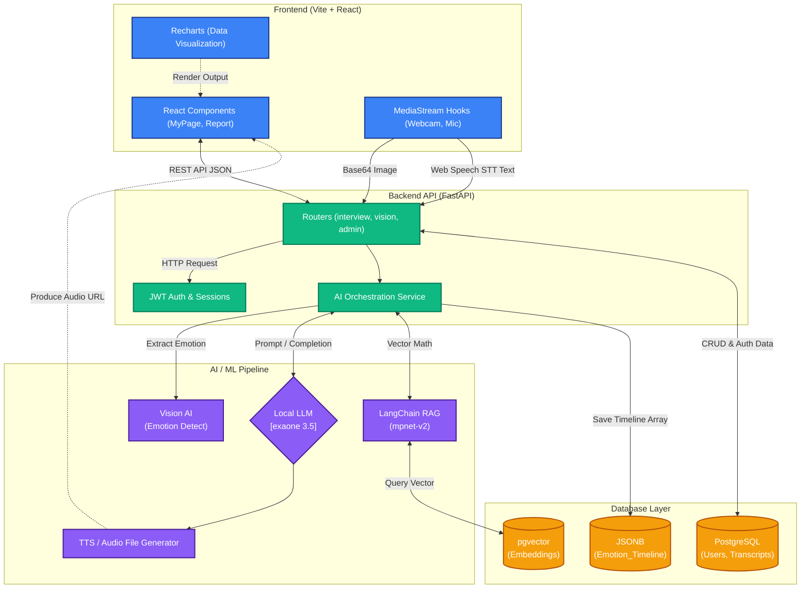

# AI 모의 면접 시스템 V2: System Architecture Detail

본 문서는 'AI 모의 면접 시스템 V2'의 아키텍처 스택과 내부 데이터 흐름, 그리고 사용 중인 기술의 실제 구현 현황을 상세하게 파악한 기술 명세입니다.

---

## 1. Frontend Architecture (React)
프론트엔드는 빠르고 직관적인 SPA(Single Page Application) 경험을 제공하기 위해 **Vite + React 18** 기반으로 구축되었습니다.

- **상태 관리 (State Management)**: `package.json` 상 Zustand 등 외부 전역 상태 라이브러리는 포함되어 있지 않으며, 핵심 상태(세션 데이터, 메시지 내역, 카메라 스트림 등)는 React의 기본 Hook(`useState`, `useRef`, `useCallback`, `useEffect`)과 컴포넌트 간 Context(또는 Props Drilling) 구조를 통해 제어되고 있습니다.
- **실시간 미디어 처리 (WebRTC / MediaStream)**: `navigator.mediaDevices.getUserMedia` API를 활용해 면접 대기실 및 실제 면접 방에서 사용자의 마이크와 웹캠 스트림을 캡처합니다. Web API의 `SpeechRecognition`을 통한 STT 스트리밍 텍스트화와 `<video>`, `<audio>` DOM 조작을 통한 TTS 자동 재생 등 브라우저 네이티브 미디어 제어에 초점이 맞춰져 있습니다.
- **차트 및 데이터 시각화**: `Recharts` 라이브러리를 도입하여 리포트(Report), 어드민 대시보드(Admin Dashboard)에서 지원자의 역량 레이더 차트(`RadarChart`), 통계 데이터 막대 그래프(`BarChart`), 그리고 비언어 감정 타임라인 선 그래프(`LineChart`)를 시각적으로 매끄럽게 렌더링합니다.

---

## 2. Backend Architecture (FastAPI)
백엔드는 고성능, 비동기 처리에 특화된 Python 프레임워크인 **FastAPI**를 선택하여 실시간 AI 연산 처리 과정의 병목을 줄였습니다.

- **비동기 처리 (Async API)**: `uvicorn[standard]`를 기반으로 구동되며, HTTP I/O, DB 트랜잭션 수집, LLM 모델 호출 및 데이터베이스 쿼리를 `async/await` 패턴으로 비동기 병렬 처리하여 면접 턴 간 지연 속도를 최적화했습니다.
- **라우팅 구조 (Modularity)**: `main.py`에 모든 로직을 두지 않고 `routers/` 패키지를 통해 도메인 주도 파티셔닝(Domain-Driven-Partitioning)을 수행했습니다.
    - `auth.py`: 사용자 계정 및 보호.
    - `interview.py`: 대화형 STT/TTS 관리, 최종 리포트 채점 체계.
    - `admin.py`: 대시보드 통계 데이터 집계 및 지원자 열람.
    - `vision.py`: Base64 프레임 전송 및 표정 감지.
    - `candidate.py`, `recruit.py`: 이력서 자동 추출 등 지원자/공고 CRUD 수행.
- **인증 및 세션 (Auth)**: JWT 로컬 인증 및 브라우저의 `localStorage` 보관 체계로 로그인 세션을 관리합니다.

---

## 3. Database & Cache Layer
관계형 DB(PostgreSQL)의 영속성 관리는 `SQLAlchemy` ORM 모델(`models.py`)로 래핑하여 사용하며 DB 세션 제어(`database.py`)를 수행합니다.

- **PostgreSQL & `pgvector`**: 
    - 메인 백엔드(`main.py`) 초기화 시점(`startup` 이벤트)에서 `CREATE EXTENSION IF NOT EXISTS vector`를 통해 **가장 우선적으로 초기화**됩니다. 
    - `QuestionBank` 테이블 등에서 면접 질문 임베딩 데이터를 저장/조회하여 RAG 유사도 검색의 중추적인 인덱스 역할을 수행합니다. 추가로 동적 평가 내역(감정 타임라인 배열 등)은 `JSONB` 형식으로 저장하여 NoSQL과 같은 유연성을 취했습니다.
- **🔍 Redis & Celery (의존성 및 리거시 분석)**: 
    - `requirements.txt` 명세에는 `redis`와 `celery` 프레임워크가 명시되어 있으나, **현재 가동 중인 `AI 모의 면접 V2` 메인 로직 코드베이스 상에는 Redis 클라이언트 인스턴스 연결이나 Celery 비동기 워커(Broker)가 실제로 구현 및 사용되고 있지 않습니다.** 
    - 즉, 현재 시스템은 인메모리 방식의 캐싱이나 외부 메시지 브로커(`Redis`) 없이, FastAPI의 Event Loop 자체 단일 비동기 흐름과 세션 스토리지를 통제하고 있는 상태이며, Redis/Celery는 향후 스케일아웃 확장을 대비한 *잠재적 확장 모듈*로 남아있는 구조입니다.

---

## 4. AI/ML Pipeline
오디오 스트리밍부터 지능 판단, 시각 통제까지 다양한 모델이 사슬처럼 엮인 **Orchestration**입니다.

- **Local LLM (`exaone3.5`) & Embeddings**: 
    - LangChain(ChatOllama) 프로바이더를 통해 로컬에서 구동되는 **`exaone3.5` 파운데이션 모델**을 AI 면접관의 두뇌로 100% 활용합니다.
    - RAG 구현 시, `sentence-transformers/all-mpnet-base-v2` HuggingFace 로컬 임베딩 모델을 호출해 문서/질문들의 벡터 유사도 거리를 계산하여 동적 꼬리 질문을 이끌어냅니다 (`app/services/ai_service.py`).
- **LangChain RAG 흐름**: '이력서 추출 텍스트' + 'Job Posting JD 요건' + '이전 답변 Context'를 수집 스토어로 구성한 뒤 `PromptTemplate`를 조합하여 문맥에서 이탈하지 않는 치밀한 꼬리 질문을 계속해서 파생시킵니다.
- **Vision AI (표정/감정)**: 프론트엔드가 초당 혹은 n초 간격으로 무음 캡처한 프레임(JPEG Base64)을 `vision.py`로 쏴주면 CV 알고리즘이 Dominant Emotion (happy, neutral, sad, angry 등)을 추출해 배열 타임라인에 담습니다.
- **STT/TTS 파이프라인**: 
    - **통신**: 프론트엔드 단의 Web Speech API 구두 인식 결과를 백엔드 LLM으로 쏘아 넘기고, 백엔드의 결정권자는 Text를 답변으로 산출한 직후,
    - 음성 합성기를 거쳐 실제 사람의 억양이 담긴 오디오 정적 파일(`.mp3`)을 `uploads/audio` 폴더에 생성합니다. 이 URL 구조를 프론트엔드 React가 Fetch해 자동으로 `HTMLAudioElement`로 재생시키는 Loop 흐름입니다.

---

## 5. Flow Diagram (Mermaid)

AI 시스템 전체의 데이터 흐름 및 상호작용 도식화입니다. (사용되지 않은 Redis/Celery는 흐름에서 제외)

